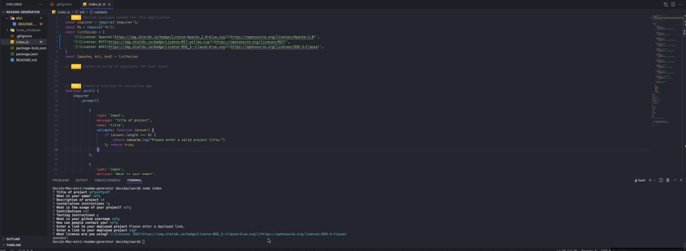

# readme-generator

David Aylward

https://davidayl.github.io/readme-generator/

## Table of Contents

* [About](#about)

* [Installation](#installation)

* [Usage](#usage)

* [Contribution](#contribution)

* [Tests](#tests)

* [Contact Me](#contact)

## About

This project is made to help people create READme files easily by just answering a handful of prompts in their terminal.  This READme was made from this application, this is achieved by using javascript and node modules.

## Installation

To install the necessary software to run this program type npm install in your console.

## Usage

This project is used for creators to make a simple but easy to follow READme.

## Tests

## Contact Me

fakemail@david.com